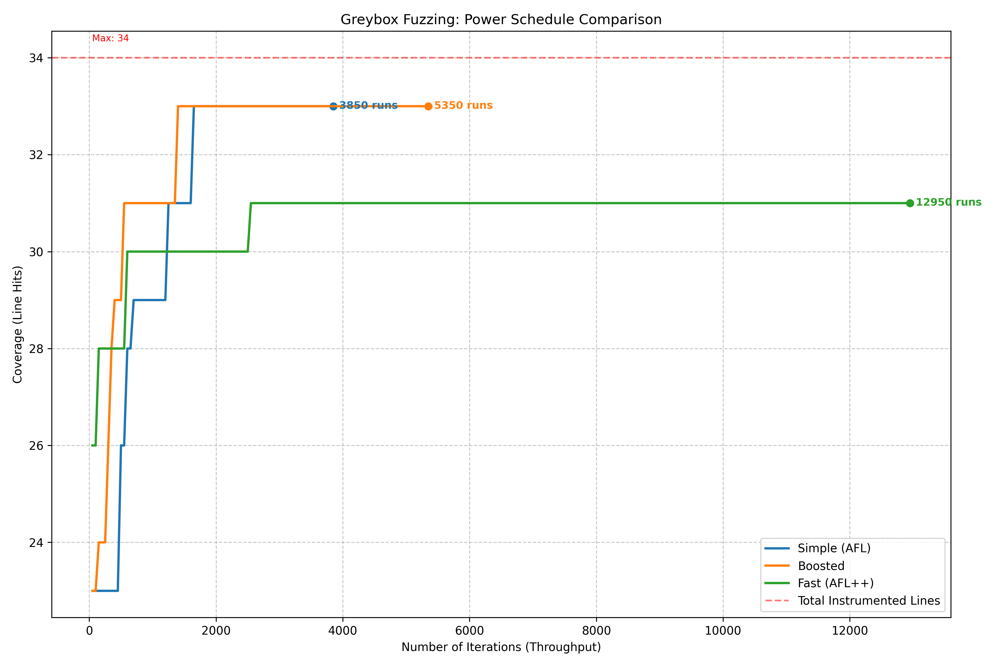
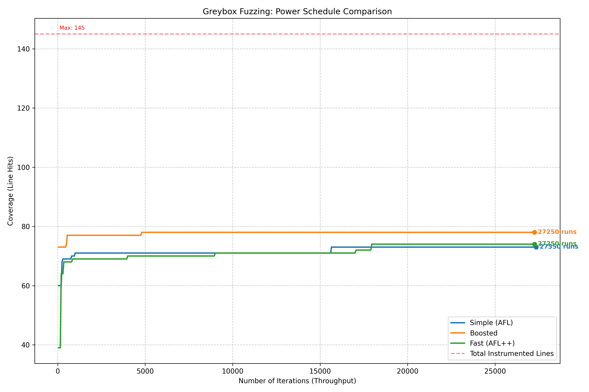
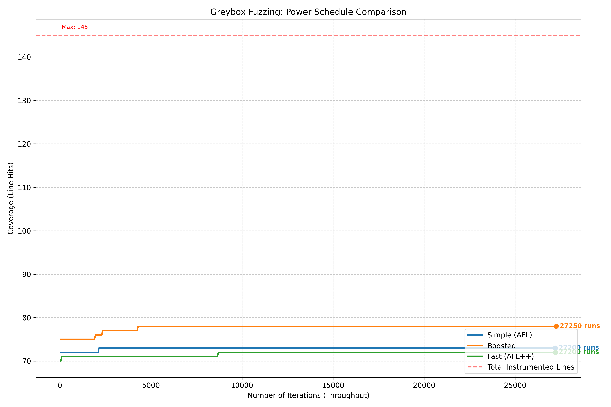
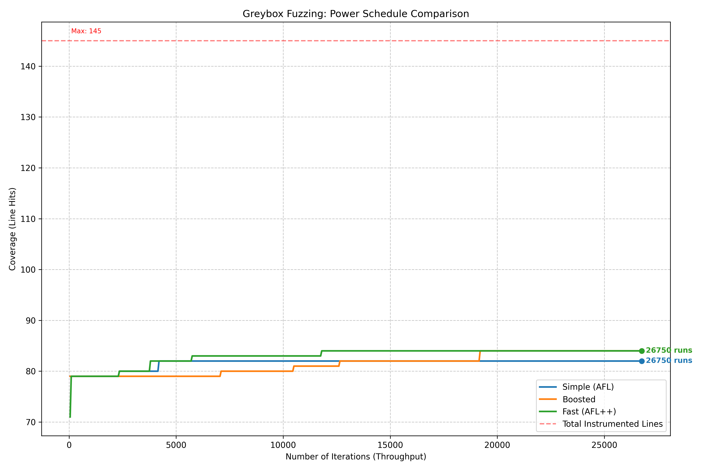

# Greybox fuzzing - NI-APT task 3

> Note: -- This heavily relies on prior knowledge about task 1 and 2 (duh). To not make this **README** novel book long, I'm assuming they (and their **READMEs**) are on hand and can be referenced.
---

In task 3 I've expanded task 2 random fuzzer to now have a second mode -- **Greybox**. In order to do this, I had to go back to task 1 and patch it to share coverage in real-time (not using `atexit`) into shared memory in `/dev/shm/...`, add new modules & classes (`lib/greybox/*.rb`) to support seed mutation,queue, etc. and patch the main `bin/fuzzer`. I tried to complete everything before soft deadline -- alas, I did not find the time to do it all, so I am at least handing in partial work to see how it fares and I will complete what I did not have time for later.

I've implemented the following mutation ops (`lib/greybox/mutator.rb`):

* **bitflip**

* **+/- 1..35 to random byte**

* **delete/insert random data of random length** (up to all data for delete and 64 bytes for insert)

* **splice** -- pick random second seed from the seed queue, split at random points and frankenstein the 2 together.

I've added support for global in `lib/oracle/asan_oracle.rb`, so it can now be caught too. I've also modified `lib/config.rb` to recognize new env vars needed (`FUZZER`,`POWER_SCHEDULE`,`INPUT_SEEDS`).

Biggest changes are in `bin/fuzzer`, as now we need to recognize 2 modes and based on that, our fuzzer behaves differently. 

>In between tasks 2 and 3 I've also made a big change to minimizers -- they are now truly parallel using forks, not just concurrent like before when using threads. This meant reworking communication between them and such. Since I am not getting coverage updates back from the minimizers though, this change is suprisingly non-impeding for task 3.

## Fuzzer changes

Aside from changing workers to be forked instead of spawning threads, logic of the main script was changed to allow for launching in 2 modes -- **blackbox** (legacy) and **greybox**. You can specify this with `FUZZER` env variable, and there are certain safeguards in place:

* You **CANNOT** launch fuzzer in **blackbox**, if `FUZZED_PROG` is pointing at directory (It should point at compiled binary).
* You **CANNOT** launch fuzzer in **greybox**, if `FUZZED_PROG` is pointing at file (It should point at folder with `.c` files it will instrument).

This has to be because I need to instrument the program for **greybox**, so that I have instrumentor (from task 1) context to set up and align shared memory for the fuzzing campaign. 
>Note that minimizer processes will run the same instrumented binary -- they will also have shared memory (at different places though, so it does not clash), which is wasteful considering I am not using this for anything currently, but it is what it is.

If we run **blackbox**, the campaign is basically the same as it was in task 2 (aside from added fields in stats, but they are `0` because we dont track coverage or anything).

If we run **greybox**, the campaign runs differently:

### Greybox

> Flow of the program run walking the greybox path. I've tried to highlight the differences introduced by task 3.

When this mode is selected, we initialize components for it in initialize -- `seed_queue` (init with entered power schedule), `mutator`, and `coverage_tracker`. We also compile the target program (`compile_target` method).

#### `compile_target`

In `compile_target`, we basically do task 1 instrumentation (modified for shared memory). **Crucially**, we **sort the files in `FUZZED_PROG` before we instrument**. This makes it so that they are registered in deterministic (sorted) order in the instrumentation code injected into `main`, which in turn means files get slots in shared memory in specific order, which we can then count on and use it to access and process shared memory from within fuzzer campaign easily. Because we know the order of the files and also number of instrumented lines of each file (since `Instrumentor` is initialized in `compile_target` so it is accessible in the fuzzer campaign) -- we can use this to trivialize memory access.

#### `run`

Then in `run` method, which sets up timeout thread, forks workers, and kicks off the campaign, we additionaly call `bootstrap_queue` method (`bootstrap_queue if @greybox_mode`).

#### `bootstrap_queue`

In `bootstrap_queue`, we try to load seeds from directory specified by `INPUT_SEEDS` env var. If it is specified we process files in it and treat them as binary blobs we use as input. If there are no seeds, we try to populate the queue by running `BOOTSTRAP_COUNT`s (fuzzer variable, **NOT env var**) generated inputs -- default is `1000`. Both of these scenarios call `process_greybox_input` method. `process_graybox_input` is also called in the main fuzzing loop after bootstrap. 

#### `process_greybox`

`process_greybox_input` method runs the input using unchanged (aside from it returning 1 additional field -- `coverage`) runner from task 2. It then takes `coverage` of the result and determines if it is interesting:
```ruby
@coverage_tracker.interesting?(result.coverage)
```
This true/false method (in `lib/greybox/coverage_tracker.rb`) deems seed interesting if *set of instrumented line IDs it hit* is larger/has new IDs compared to the *set of hit IDs maintained till this point*. It also updates this maintained set with new IDs if the seed hit them. It also calculates seed hash for later use in `seed_queue` when calculating energies.

Additionaly, if this seed caused a bug, it defaults to being interesting too.

Interesting seeds are added to `seed_queue`.

#### `run_one_iteration`

Coming back from the bootstrap, we go into the main loop of the campaign -- `run_main_fuzzing_loop`, inside of which we care about `run_one_iteration`. This method just branches based on mode. For greybox, it samples queue for seed it should use, then mutates it using `mutator`, then runs `process_greybox_input`.

## AI

Same disclosure as in task 2 **README**, with 1 exception -- the script used to generate graphs for the experiment (`/task_3_experiment/plot.py`) is vibe coded.  

## Setup

Only additional dependencies compared to previous tasks is python and its modules for plotting (`pandas` and `matplotlib`), if you want to do it locally. Rest of the code is basically all ruby, so that is of course a requirement for local runs too. With you ruby you can then simply do `bundle install` in the root of the repo which will install required gems from the `Gemfile`

## Testing

I've made sure that the legacy (task 1 and 2) test suites still work, but they of course dont test the new code paths (fully up to date coverage goes hand in hand with the mutation testing, which I dont have yet). 

When task 2 tests are run, the coverage is slightly smallert than it was -- because parts of the fuzzer, such as `lib/oracle/asan_oracle.rb` and `lib/config.rb` were extended to allow task 3 to work, so the relative % of code covered goes down.

### Coverage

**92.57%**(see context above)

### Mutation testing

**TODO 🥲**

## Experiment

For the experiment, I've first added hotfixes (I kept them in the code, just commented them out) to the fuzzer script to record # of fuzzed inputs, coverage, time, and # of instrumented lines into `.csv` file. 

I've ran the fuzzer 3 times (Once for each `POWER_SCHEDULE`) on the same `mock.c` program I was using in previous task (`target_programs/greybox_test`):
```bash
#fast
export FUZZED_PROG=target_programs/greybox_test/ && export RESULT_FUZZ=./experiment_fast_ps && export INPUT=stdin && export MINIMIZE=1 && export TIMEOUT=310 && export FUZZER=greybox && export POWER_SCHEDULE=fast && make run
```
```bash
#simple
export FUZZED_PROG=target_programs/greybox_test/ && export RESULT_FUZZ=./experiment_simple_ps && export INPUT=stdin && export MINIMIZE=1 && export TIMEOUT=310 && export FUZZER=greybox && export POWER_SCHEDULE=simple && make run
```
```bash
#boosted
export FUZZED_PROG=target_programs/greybox_test/ && export RESULT_FUZZ=./experiment_boosted_ps && export INPUT=stdin && export MINIMIZE=1 && export TIMEOUT=310 && export FUZZER=greybox && export POWER_SCHEDULE=boosted && make run
```

Then I did the same on a more complex `uniq.c` program from the repo linked on courses.

> I had to tweak the `.c` code a little bit, because short form conditionals such as `if (cond) code;` without braces break my instrumentation. But the code should behave the same, I just added braces. Code can be found in `target_programs/task3_uniq`.

### Results -- `mock.c`



---

For `mock.c`, the results are what I would expect. It follows the expected shape of the chart -- that being initial sharp increase in coverage, leading to a plateau. I'd say this shows that the power profiles behave somewhat as expected -- boosted being the best, fast having fuzzed most inputs etc.

### Results -- `uniq.c`

I produced **3** sets for `uniq.c`. First run was `stdin` mode, and the random generator did not support `\n` in inputs. Its results are



---

This was a let down at first, as I would hope for better coverage, especially when seeing the results on `mock.c`. I looked into the code of `uniq.c` and at first, I though the biggest culprit is that I did not allow newlines in the input. This is because the program is inherently line-oriented and random one-liner inputs without newlines are not exercising the paths mutch. To verify, I've added newline to the generator charset (done in fuzzer script) and ran the suite again.




---

This has improved the start coverage, but it did not have the effect I would hope for. While I still think newlines are essensial for this specific program, it is certainly not the whole story.

Last test suite I ran was with input set to `file`, which improved the coverage a little bit. I suspect this is by exercising some additional paths (`file` wrapper function).



### Conclusion

Given that for `mock.c` the fuzzer behaves exactly as expected, I thought about why the same results were not replicated in `uniq.c` and these are my final thoughts + what I think could be done to target this program specifically, but I did not do it because of time or other reasons. If you were to add these things I talk about below, I am fairly certain the graph would be the same as for the `mock.c` file.

#### Why is the coverage low?

When looking at `uniq.c`, it seems that exercising different coverage paths requires distinc inputs, but those inputs need to adhere to certain form/structure. What I mean:

* newlines are crucial, as without them the core of the program never runs, because we consume the 1 line we have and exit.

* even with newlines, to exercise different branches, we need to match scenarios such as **multiple lines being the same** (to trigger the `else` block where `repeats` is incremented). this will very rarely (if ever) happen -- I suspect more testing with specific seeds that prime the fuzzer for these patterns would help a lot.

* what is almost certainly the biggest roadblock for coverage -- the fact that we just pass in input and do nothing about the flags passed in with `argv`.

#### What could be done to target this specific program?

I think that the best course of action would be to separate and fuzz both flags in `argv` and combine this with fuzzing of data (input) in `file` or `stdin` -- easiest would probably be something like generating inputs of at least size `N`, where these first `N` bytes are gonna encode flags we pass in, then the rest is the input. Furthermore, we could do it so that we can pass seeds to the fuzzer with inputs that would give it these interesting inputs, such as multiple same lines, different lines, flag configs etc. 


## TODO/Issues

These are some TODOs deduced from seeing the grader run + things I noted down. If time allows, I'd like to eventually add these before hard deadline. + Known issue I encountered

* **TODO -- Mutation testing** (duh)

* **TODO -- Make it so splicing is only made once queue goes stale + make it sample based on energy, not randomly** -- this will require to rewrite how sampling works / implement mutation op selection in `bin/fuzzer`, so we have the context to call queue sample.

* **TODO -- Make it so that if queue goes stale, we jolt it back up with few random inputs?**

* **ISSUE -- program `uniq.c` wont compile in the grader** -- because it contains one-liner conditionals (`if (cond) code;`) without brackets and my code coverage tool does not support this 😅 (nor does it have to, as it is optional feature in task 1 description). By pure chance, I used it in my **experiment** and so I had to modify it, so you can check its results there. 

* **ISSUE -- Sometimes, statistics dont save, even though I kill the campaign 10 seconds earlier** -- I have yet to figure this out, because it is not that it does not have time to save it (it ends sooner than after 10 seconds it has dedicated for saving)... it just does not save the file 🥲.